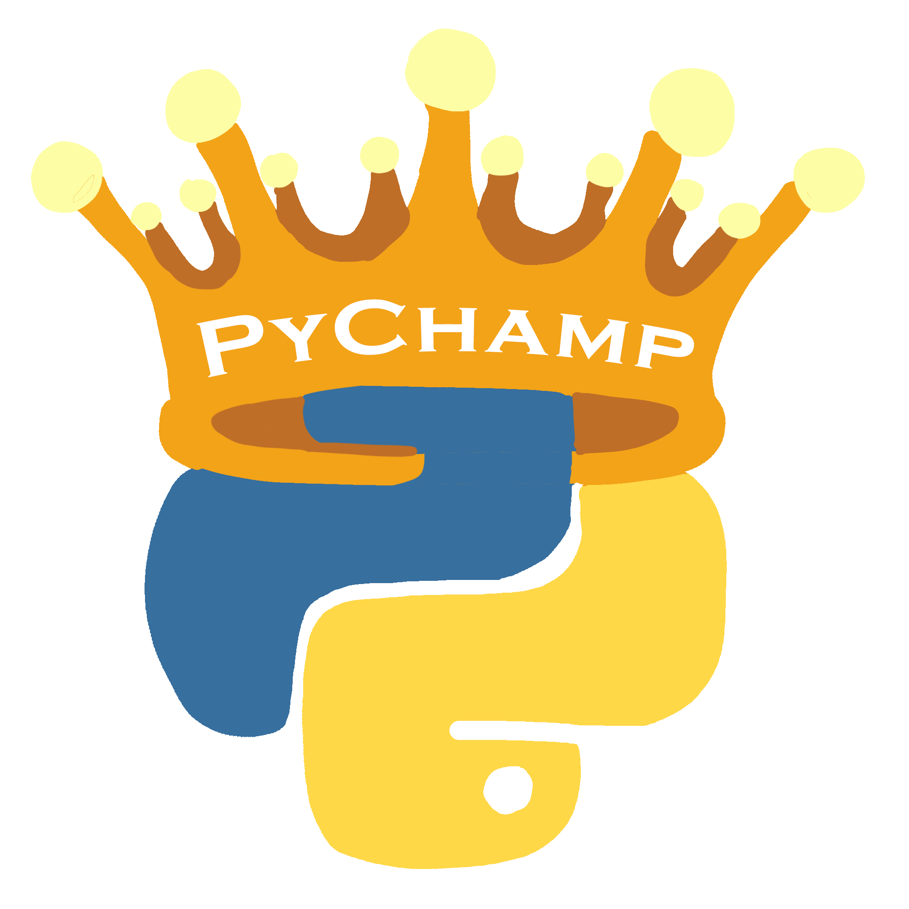

<h1 align="center">
  
</h1>


<h1 align="center">
  <a href="https://www.youtube.com/channel/UCA9JRgMqaKB6XfLYkh2Dsjw">
    
  </a>
</h1>


<center>

<p align="center">
  <a href="https://github.com/NapoII/PyChamp/archive/refs/heads/main.zip">
    
  </a>
  <a href="https://github.com/NapoII/PyChamp/archive/refs/heads/main.zip">
    
  </a>
  <a href="https://github.com/NapoII/PyChamp/blob/main/LICENSE">
    
  </a>
  <a href="https://github.com/NapoII/PyChamp/issues">
    
  </a>
  <a href="https://github.com/NapoII/PyChamp/stargazers">
    
  </a>
  <a href="https://discord.gg/knTKtKVfnr">
    
  </a>
</p>

</center>

<a href="https://www.youtube.com/shorts/F4DPTMW2Mcg">
  
</a>
Welcome to my channel dedicated to Python programming! If you're passionate about coding, automation, data analysis, web development, or any other application of Python, you've come to the right place.

On this channel, I'll share my knowledge and experience of working with Python, from beginner-friendly tutorials to advanced topics and real-world projects. You'll learn how to write clean, efficient, and well-structured code, how to use popular libraries and frameworks, and how to solve common programming challenges.

Whether you're just starting out or looking to improve your skills, this channel will provide you with valuable insights and resources to help you succeed in your Python journey. So hit that subscribe button and join our community of Python enthusiasts today!

---

## 📝🎥 Table of YT Contents

+ [How easy it is to create a log with Python](#-1-)
+ [Create a GUI in 1 min](-2-)
+ [clean your path](-3-)

+ [Install](#usage)
+ [Lizenz](#Lizenz)
  
## 🎥 [How easy it is to create a log with Python](./PyChamp/-1-%20LogNow) <a name="-1-"></a>

A small tutorial on how to create a log file in pyhton.
  ```CMD
  pip install logNow  
  ```
https://www.youtube.com/shorts/F4DPTMW2Mcg
  
https://github.com/NapoII/logNow

## 🎥 [Create a GUI in 1 min](./PyChamp/-2-%20Fast%20PyGUI) <a name="-2-"></a>
Create a small user interface for your programme very quickly
  ```CMD
  pip install pyautogui  
  ```
https://www.youtube.com/shorts/n594oH_dtvI

https://pyautogui.readthedocs.io


## 🎥 [clean your path](./PyChamp/-3-%20rightPath) <a name="-2-"></a>

Clean your path. 
https://youtube.com/shorts/F4DPTMW2Mcg
https://docs.python.org/3/library/os.html


---

## 💻 Install <a name = "usage"></a>
```cmd
git clone https://github.com/NapoII/PyChamp

pip install -r requirements.txt
```

## 📚 Lizenz <a name = "Lizenz"></a>
MIT License

Copyright (c) 2023 NapoII
<small><small><small>
Permission is hereby granted, free of charge, to any person obtaining a copy
of this software and associated documentation files (the "Software"), to deal
in the Software without restriction, including without limitation the rights
to use, copy, modify, merge, publish, distribute, sublicense, and/or sell
copies of the Software, and to permit persons to whom the Software is
furnished to do so, subject to the following conditions:

The above copyright notice and this permission notice shall be included in all
copies or substantial portions of the Software.

THE SOFTWARE IS PROVIDED "AS IS", WITHOUT WARRANTY OF ANY KIND, EXPRESS OR
IMPLIED, INCLUDING BUT NOT LIMITED TO THE WARRANTIES OF MERCHANTABILITY,
FITNESS FOR A PARTICULAR PURPOSE AND NONINFRINGEMENT. IN NO EVENT SHALL THE
AUTHORS OR COPYRIGHT HOLDERS BE LIABLE FOR ANY CLAIM, DAMAGES OR OTHER
LIABILITY, WHETHER IN AN ACTION OF CONTRACT, TORT OR OTHERWISE, ARISING FROM,
OUT OF OR IN CONNECTION WITH THE SOFTWARE OR THE USE OR OTHER DEALINGS IN THE
SOFTWARE
    
<p align="center">

</p>
